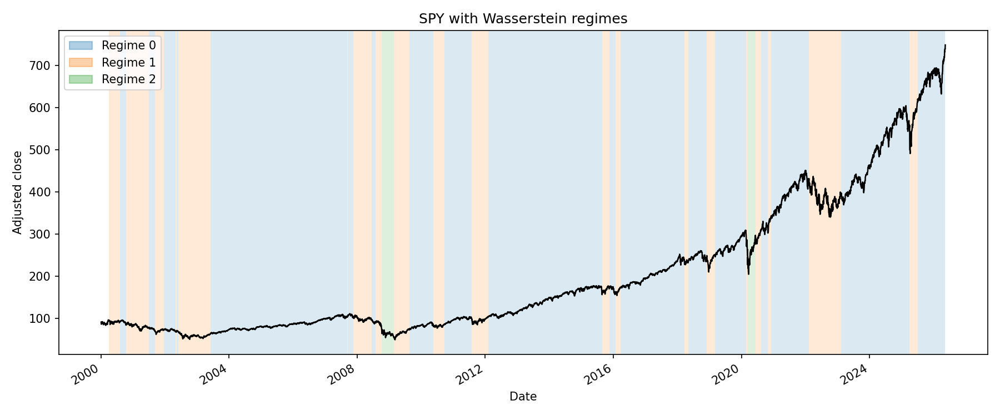
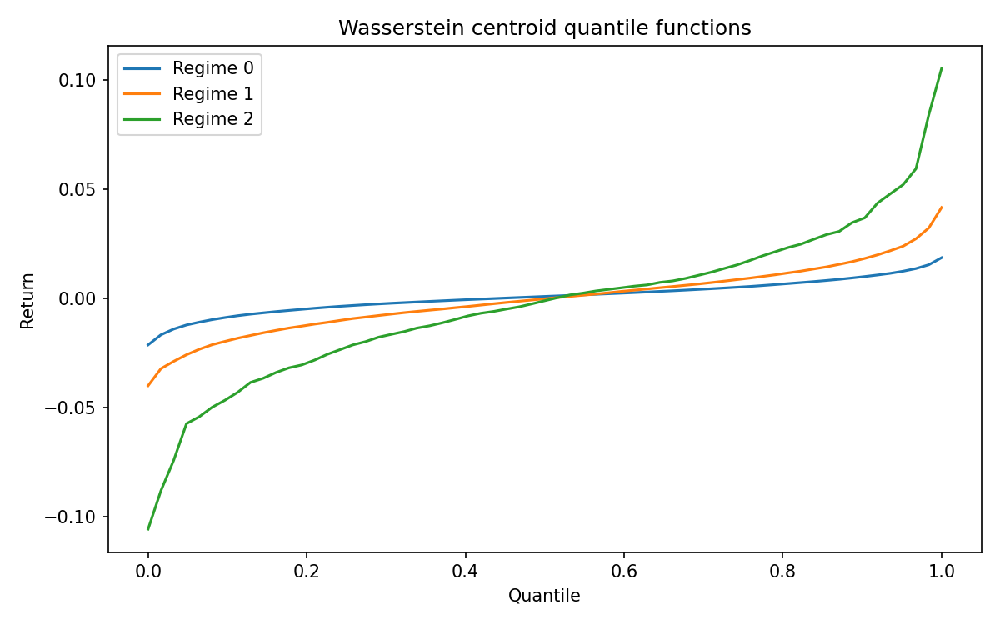

# Wasserstein Market Regime Clustering

**K-means on full return distributions, not just mean and volatility.**

This is a Python research-reproduction project for market regime clustering
with Wasserstein distance and optimal transport ideas. It downloads market
prices, converts rolling return windows into empirical probability
distributions, clusters those full distributions with a custom Wasserstein
k-means implementation, and compares the results with classical moment-based
baselines.

The main point: the Wasserstein model does **not** cluster only mean,
volatility, skew, or other summary features. Those summaries are used only for
baseline comparisons. The primary model compares entire sorted return
distributions.

## What This Repo Demonstrates

- A from-scratch 1D Wasserstein k-means implementation for empirical return
  distributions
- SPY regime clustering with price overlays, centroid quantile plots, and
  transition diagnostics
- Moment-feature KMeans and Gaussian mixture baselines for comparison
- An illustrative walk-forward backtest path with explicit timing controls
- A tested package structure suitable for GitHub and portfolio review

## Research Background

The implementation is motivated by:

1. Blanka Horvath, Zacharia Issa, and Aitor Muguruza, *Clustering Market Regimes using the Wasserstein Distance*, 2021. [arXiv:2110.11848](https://arxiv.org/abs/2110.11848), [SSRN 3947905](https://papers.ssrn.com/sol3/papers.cfm?abstract_id=3947905).
2. Yubo Zhuang, Xiaohui Chen, and Yun Yang, *Wasserstein K-means for clustering probability distributions*, NeurIPS 2022. [arXiv:2209.06975](https://arxiv.org/abs/2209.06975).
3. Related optimal transport methods for distributional time-series clustering

Traditional regime models often reduce each window to summary statistics such
as mean, volatility, skew, or drawdown. Those features are useful baselines, but
they discard distribution shape. Two windows can share similar volatility while
having very different downside tails, asymmetry, or quantile structure.

This repo keeps the full empirical distribution. A 63-day return window is not
converted into a scalar feature vector for the main model; it remains a set of
63 observed returns.

## Methodology

For a ticker such as SPY:

1. Download adjusted close prices.
2. Compute log returns.
3. Build overlapping rolling return windows.
4. Treat each window as an empirical distribution.
5. Compare windows using 1D Wasserstein distance.
6. Cluster windows with custom Wasserstein k-means.
7. Compare against moment-feature KMeans and Gaussian mixture baselines.
8. Evaluate regimes with distance metrics, transition matrices, centroid
   quantile plots, price overlays, and an illustrative walk-forward backtest.

For equal-length 1D empirical distributions, the optimal transport matching is
simple: sort both samples and compare equal quantile ranks.

```python
W_2(x, y) = sqrt(mean((sort(x) - sort(y)) ** 2))
W_1(x, y) = mean(abs(sort(x) - sort(y)))
```

The Wasserstein barycenter is implemented as the average sorted quantile
function across all distributions assigned to a cluster. Each centroid is
therefore a sorted return distribution, not a mean/variance vector.

## Project Layout

```text
notebooks/        # exploration, clustering, and backtest notebooks
reports/figures/  # small tracked sample figures for GitHub preview
scripts/          # reproducible experiment entry points
src/regime_ot/
  data.py          # download and cache adjusted close prices
  returns.py       # log/simple returns and cleaning
  windows.py       # rolling empirical distributions
  wasserstein.py   # 1D distance, pairwise matrix, barycenter
  wkmeans.py       # custom WassersteinKMeans
  baselines.py     # moment KMeans and GMM baselines
  evaluation.py    # cluster stats, silhouettes, transitions
  plotting.py      # matplotlib regime diagnostics
  backtest.py      # illustrative walk-forward regime strategy
  cli.py           # command-line workflows
tests/             # unit tests for math, clustering, evaluation, backtest
```

## Quick Start

Python 3.11+ is the intended runtime.

```bash
conda env create -f environment.yml
conda activate regime-ot
pip install -e .
```

Run the primary SPY workflow:

```bash
python scripts/run_spy_experiment.py --ticker SPY --window 63 --clusters 3
```

This downloads/cache data under `data/raw/`, fits the Wasserstein model, writes
figures under `reports/figures/`, and prints clustering/backtest diagnostics.

## Usage

Download market data:

```bash
python -m regime_ot.cli download --tickers SPY QQQ TLT GLD --start 2000-01-01
```

Run the primary SPY Wasserstein clustering workflow:

```bash
python -m regime_ot.cli run-wkmeans --ticker SPY --window 63 --clusters 3
```

Run the script version:

```bash
python scripts/run_spy_experiment.py --ticker SPY --window 63 --clusters 3
```

If you prefer pip-only setup:

```bash
python -m venv .venv
source .venv/bin/activate
pip install -r requirements.txt
pip install -e .
```

The script uses full-sample Wasserstein clustering for exploratory regime plots
and silhouette diagnostics. Its printed backtest metrics use the stricter
walk-forward helper, which refits centroids only on windows available at each
decision date and shifts the position into the next return period.

Run tests:

```bash
pytest
```

## Results And Outputs

The SPY experiment writes figures to `reports/figures/`, including:

- `reports/figures/SPY_regimes.png`: SPY price with regime-colored background spans
- `reports/figures/SPY_centroids.png`: Wasserstein centroid quantile functions
- `reports/figures/SPY_transitions.png`: regime transition matrix

Tracked sample figures are intentionally small PNG files suitable for GitHub
rendering. Raw downloaded data under `data/raw/` is ignored by Git.





The notebook `notebooks/02_wasserstein_regime_clustering.ipynb` runs k=2, k=3,
and k=4, compares silhouette scores, plots regimes over price, visualizes
centroid distributions, and compares the Wasserstein model against KMeans on
moment features.

## Backtest Caveat

The backtest is illustrative, not predictive. Regime labels are unsupervised and
do not guarantee future returns. The stricter walk-forward helper fits
Wasserstein centroids only on historical windows available at each decision
date, identifies the high-risk centroid from historical centroid dispersion,
and shifts positions so labels can affect only subsequent returns.

If you call `regime_strategy_backtest` with labels from a model fit on the full
sample, the position timing is shifted correctly, but the labels themselves are
still in-sample diagnostics rather than a fully out-of-sample signal.

This project is not investment advice.

## Limitations

- The first implementation focuses on single-asset SPY workflows.
- Multi-asset scripts are a lightweight extension, not a full cross-sectional
  allocation model.
- 1D Wasserstein distance is appropriate for univariate return windows; richer
  multivariate transport would require additional modeling choices.
- Clustering is unsupervised, so regime names such as "low risk" or "high risk"
  are interpretations based on diagnostics, not labels learned from future
  outcomes.
- Data quality depends on Yahoo Finance through `yfinance`.
- The implementation demonstrates the 1D equal-sample empirical case; it is not
  a full reproduction of every experiment, benchmark, or theorem in the papers.

## Git Workflow

- Work on `main` unless a separate feature branch is needed.
- Commit after coherent milestones and passing checks.
- Do not commit secrets, virtual environments, caches, raw market data, or large
  generated artifacts.
- Do not push unless explicitly requested.

## License

MIT. See [LICENSE](LICENSE).
